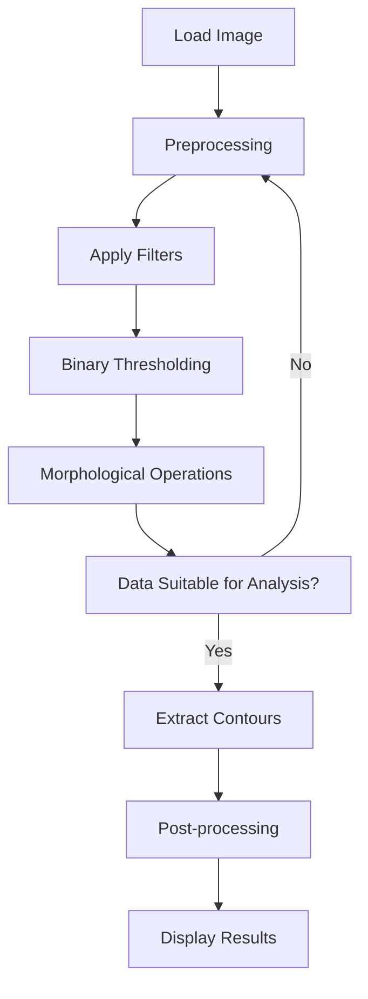

# LAB Grayscale Image Segmentation

**Date: 2023.03.20** 

**StudentID: 21800805** 

**Name: Hwang SeungEun**


## I. Introduction

The goal of this project is to classify bolts and nuts randomly located in an industrial setting using classical image processing techniques.

## II. Procedure

1. Load the grayscale image (JPG format).
2. Preprocess the image:
   - Apply a median filter with a kernel size of 5.
   - Use a threshold value of 116 with binary mode to binarize the data.
   - Perform Morphology operations: dilate 15 times, erode 24 times, dilate 2 times, open 2 times, and dilate 1 time to separate connected objects.
   - If the data is not suitable for analysis, repeat the preprocessing steps.
3. Extract contours.
4. Post-process the contours by measuring their lengths to classify the objects  
5. Display the results.

## III. Flowchart



## IV. Experiment

### 1. Load Image

The grayscale image in JPG format was loaded. This image contains randomly placed bolts and nuts, simulating a real-world industrial setting where such objects are commonly found.

- M6 Bolt 3EA
- M5 Bolt 5EA
- M6 Nut 4EA
- M5 Nut 4EA
- M5 Rect 5EA


### 2. Preprocessing

A series of preprocessing steps were applied to the image to prepare it for analysis. These steps aimed to enhance the image quality and separate the individual objects as much as possible:

#### Filter

There are lot of perper and salt noise.  If did not remove the noise before use Threshold. The noise will be amplified. So I used the "Median" filter

Median filter with kernel size 5: This filter was applied to reduce noise in the image while preserving the edges of the objects. If the curnel size more bigger then 5.  The image will be more blu.


#### Threshold

Below figure is Gray scale of image Histogram. It shown most intensity belolw 125. Therefore I selct the threshold value 116.


Thresholding with a value of 116 in binary mode: The image was binarized using a threshold value of 116 to create a clear distinction between the objects and the background.


#### Morphology

These operations were performed in the following sequence: 15 dilations, 24 erosions, 2 dilations, 2 openings, and 1 dilation. These steps were crucial in separating the connected objects, making them easier to analyze.


### 3. Contour Extraction

Contours were extracted from the preprocessed image. The blue number is length of contours, black is area of contours. 

These contours numbers represent the boundaries and length of the individual objects (bolts and nuts) in the image.


### 4. Post-processing

The lengths of the contours were measured to classify the objects as bolts or nuts. Initially, the contour areas were used for classification, but this approach was not successful. The switch to contour length measurement proved to be more effective in differentiating between the two types of objects. This method allowed for a more accurate classification without relying on specific indices.


## V. Analysis

The process of separating objects was challenging. Various algorithms were tested, including counting the number of contours within a contour to determine the number of nuts. However, objects couldn't be separated, and the current method using Morphology operations was adopted. This approach proved to be more successful in separating the connected objects and enabling accurate classification.


## VI. Result

After numerous trials and errors, the objects were successfully classified without using specific indices. The separation of the objects and the generalization of the classification process were achieved. However, needs to be improved is the high number of iterations in the Morphology operations, which may be optimized in future implementations.


## VII. Appendix

```c++
#include "myFunc.h"

#define M6_bolt		0
#define M5_bolt		1
#define M6_Nut		2
#define M5_Nut		3
#define M5_rect		4

Mat  src, dst, dst_filt, dst_thres, dst_morph, dst_cont, combine, dst_stack;

void Img_read(void);

void IMG_processing(void);

void Filter_Process(Mat& _input, Mat& _output, int _filter, int _kernel);

void Threshold_Process(Mat& _input, Mat& _output, int _value);

void Morphology_Process(Mat& _input, Mat& _output);

void Print_Window(String& _message, Mat& _src);

void Contour_Processing(Mat& _input, vector<vector<Point>>& _contour, vector<Vec4i>& _hierarchy);

void print_result(void);

int kernel = 5;
int thresh_value = 116;

Scalar colors[5] = {
	Scalar(255, 0, 0),  // 파랑색
	Scalar(0, 0, 255),  // 빨강색
	Scalar(0, 255, 255),  // 노랑색
	Scalar(0, 255, 0),  // 녹색
	Scalar(255, 255, 0)  // 하늘색
};

vector<vector<Point>> contours;
vector<Vec4i>	hierarchy;

vector <string> name = { "M6_bolt", "M5_bolt", "M6_Nut", "M5_Nut", "M5_rect" };
vector <int> count_obj = { 0, 0, 0, 0 ,0 };

int main() {

	// image processing
	IMG_processing();

	// print result
	print_result();

	// Wait until user finishes program
	while (true) {
		int c = waitKey(20);
		if (c == 27)
			break;
	}

	return 0;
}

/* Print the gray scale image
* _message: Title
* _src: wanted to print matrix
*/
void Print_Window(String& _message, Mat& _src)
{
	namedWindow(_message, 0);
	resizeWindow(_message, Size(800, 800));
	imshow(_message, _src);
}

void Filter_Process(Mat& _input, Mat& _output, int _filter, int _kernel) {

	if (_filter == BLUR) {

		blur(_input, _output, Size(_kernel, _kernel),Point(-1, -1));

	}
	else if (_filter == GAUSSIAN) {

		GaussianBlur(_input, _output, Size(_kernel, _kernel), 0);
		//text = "MODE: GAUSSIAN";
	}
	else if (_filter == MEDIAN) {

		medianBlur(_input, _output, _kernel);

	}
	namedWindow("Filter imgae", WINDOW_FREERATIO);
	resizeWindow("Filter imgae", Size(800, 800));
	imshow("Filter imgae", _output);
}

void Threshold_Process(Mat& _input, Mat& _output, int _value) {

	/*
	* THRESH_BINARY     = 0
	* THRESH_BINARY_INV = 1
	* THRESH_TRUNC      = 2
	* THRESH_TOZERO     = 3
	* THRESH_TOZERO_INV = 4
	*/

	int _type = 0;

	if (_type == 8) {
		
		adaptiveThreshold(_input, _output, 255, ADAPTIVE_THRESH_GAUSSIAN_C, THRESH_BINARY, 11, 2);
		_output = 255 - _output;
	}
	else {

		threshold(_input, _output, _value, 255, _type);

	}
	namedWindow("Thresh imgae", WINDOW_FREERATIO);
	resizeWindow("Thresh imgae", Size(800, 800));
	imshow("Thresh imgae", _output);
}

void Img_read(void) {

	// img load
	src = imread("Lab_GrayScale_TestImage.jpg", 3);

	// cvtColor BGR2GRAY
	cvtColor(src, dst, COLOR_RGB2GRAY);

	namedWindow("raw imgae", WINDOW_FREERATIO);
	resizeWindow("raw imgae", Size(800, 800));
	imshow("raw imgae", src);

	// Load image check
	if (src.empty())
	{
		cout << "File Read Failed : src is empty" << endl;
		waitKey(0);
	}
}

void Morphology_Process(Mat& _input, Mat& _output) {

	int element_shape = MORPH_RECT;		// MORPH_RECT, MORPH_ELLIPSE, MORPH_CROSS
	int n = 3;
	Mat element = getStructuringElement(element_shape, Size(n, n));

	/*
		* 0: None
		* 1: Erode
		* 2: Dilate
		* 3: Close
		* 4: Open
	*/

	// NoGaDA
	dilate(_input, _output, element, Point(-1, -1), 15);
	erode(_output, _output, element, Point(-1, -1), 24);
	dilate(_output, _output, element, Point(-1, -1), 2);
	morphologyEx(_output, _output, MORPH_OPEN, element, Point(-1, -1), 1);
	dilate(_output, _output, element, Point(-1, -1), 1);

	namedWindow("Morph imgae", WINDOW_FREERATIO);
	resizeWindow("Morph imgae", Size(800, 800));
	imshow("Morph imgae", _output);
}

void Contour_Processing(Mat& _input, vector<vector<Point>>& _contour, vector<Vec4i>& _hierarchy){
	
	findContours(_input, _contour, _hierarchy, RETR_TREE, CHAIN_APPROX_SIMPLE);
	for (size_t i = 0; i < _contour.size(); i++) {

		int area = contourArea(_contour[i]);

		int len = arcLength(_contour[i], true);
		Rect box = boundingRect(_contour[i]);
		Point org = Point(box.br().x, box.tl().y);
		Point org1 = Point(box.br().x, box.tl().y - 30);

		if (len > 500) {

			count_obj[M6_bolt]++;
			drawContours(src, _contour, i, colors[M6_bolt], 2, LINE_8, _hierarchy);
			putText(src, name[M6_bolt], org, FONT_HERSHEY_SIMPLEX, 1, colors[M6_bolt], 2, LINE_AA);

		}else if (len > 350 && len < 420) {

			count_obj[M5_bolt]++;
			drawContours(src, _contour, i, colors[M5_bolt], 2, LINE_8, _hierarchy);
			putText(src, name[M5_bolt], org, FONT_HERSHEY_SIMPLEX, 1, colors[M5_bolt], 2, LINE_AA);

		}else if (len > 220 && len < 250) {

			count_obj[M6_Nut]++;
			drawContours(src, _contour, i, colors[M6_Nut], 2, LINE_8, _hierarchy);
			putText(src, name[M6_Nut], org, FONT_HERSHEY_SIMPLEX, 1, colors[M6_Nut], 2, LINE_AA);

		}else if (len > 180 && len < 220) {

			count_obj[M5_Nut]++;
			drawContours(src, _contour, i, colors[M5_Nut], 2, LINE_8, _hierarchy);
			putText(src, name[M5_Nut], org, FONT_HERSHEY_SIMPLEX, 1, colors[M5_Nut], 2, LINE_AA);

		}else if (len > 150 && len < 180) {

			count_obj[M5_rect]++;
			drawContours(src, _contour, i, colors[M5_rect], 2, LINE_8, _hierarchy);
			putText(src, name[M5_rect], org, FONT_HERSHEY_SIMPLEX, 1, colors[M5_rect], 2, LINE_AA);
		}
	}
	namedWindow("Output image", WINDOW_FREERATIO);
	resizeWindow("Output image", Size(800, 800));
	imshow("Output image", src);
}

void print_result(void) {

	printf("M6_bolt: %d \n",	count_obj[M6_bolt]);
	printf("M5_bolt: %d \n",	count_obj[M5_bolt]);
	printf("M6_Nut : %d \n",	count_obj[M6_Nut]);
	printf("M5_Nut : %d \n",	count_obj[M5_Nut]);
	printf("M5_rect: %d \n\n",	count_obj[M5_rect]);

	int total = count_obj[M6_bolt] + count_obj[M5_bolt] + count_obj[M6_Nut] + count_obj[M5_Nut] + count_obj[M5_rect];
	printf("Total : %d \n\n", total);
}

void IMG_processing(void) {

	// Image read
	Img_read();

	// filter
	Filter_Process(dst, dst_filt, MEDIAN, kernel);

	// threshold
	Threshold_Process(dst_filt, dst_thres, thresh_value);

	// morphlogy
	Morphology_Process(dst_thres, dst_morph);

	// Find contours
	Contour_Processing(dst_morph, contours, hierarchy);
}
```

