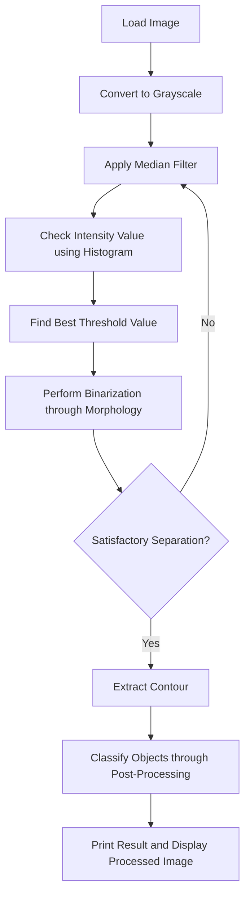

# LAB: Grayscale Image Segmentation

**Date: 2023-04-06** 

**Student ID: 21800805** 

**Name: Hwang SeungEun**


## I. Introduction

The main goal of this experiment is to use proper classical image processing techniques with C++ OpenCV to distinguish bolts and nuts from images. The importance of this experiment lies in understanding the sequence of the image processing process and properly utilizing filters, thresholds, and morphology suitable for image characteristics to perform various processing tasks.


## II. Procedure

1. Load the image.
2. Convert the image to grayscale.
3. Apply a median filter to reduce the effect of noise.
4. Check the intensity value using the histogram.
5. Find the threshold value with the best separation.
6. Perform binarization through morphology. If the separation is not satisfactory, repeat from step 3.
7. If satisfactory binarization data is obtained in step 6, extract the contour.
8. Classify the objects through data post-processing.
9. Print the result and display the processed image.


## III. Flowchart




## IV. Experiment

### 1. Load the image

The image selected for this experiment contains the following objects:

- M6 Bolt: 3EA
- M5 Bolt: 5EA
- M6 Nut: 4EA
- M5 Nut: 4EA
- M5 Rect: 5EA

This image was chosen because it has a variety of objects that can be distinguished through image processing techniques.


### 2. Convert to grayscale

The image was converted to grayscale because there is a noticeable difference in brightness between the color of the objects and the color of the background. It was deemed effective to change the image to a single channel and classify the objects in the image based on their intensity.


### 3. Apply a median filter to reduce the effect of noise

The grayscale image was found to contain a significant amount of pepper & salt noise. If the data were binarized without applying a filter, the noise would be amplified as well. Since the median filter is known to be highly effective in reducing pepper & salt noise, it was used in this step to minimize noise.


### 4. Check the intensity value using the histogram

A histogram is used to visually confirm the intensity distribution in the grayscale image. By examining the histogram, a threshold value can be designated where the intensity distance between the object and the background pixel is maximized, ensuring optimal separation.


### 5. Find the threshold value with the best separation

As discussed in step 4, it is important to ensure that the object and the background are well separated when there is a large distance between their intensity values. This distance will be used as a threshold parameter, so selecting an appropriate value is crucial for successful segmentation.


### 6. Perform binarization through morphology

Morphological functions, such as erosion and dilation, were used to enhance the distinction between objects. In particular, multiple iterations were performed to separate objects that were attached, ensuring a more accurate segmentation process.


### 7. Extract the contour

Contours were extracted to identify features such as the length and width of the bolts and nuts. This information can be used for further analysis and classification of the objects in the image.


### 8. Classify through data post-processing

Objects were classified as bolts or nuts by measuring the lengths of their contours. Initially, contour areas were used for classification, but this approach was not successful. The switch to contour length measurement proved to be more effective in differentiating between the two types of objects. This method allowed for a more accurate classification without relying on specific indices.


## V. Analysis

In classical image processing for successful object classification, several key steps should be followed:

1. Output a histogram and find an appropriate threshold value using intensity values.
2. Apply a filter to reduce noise.
3. Use the threshold value obtained earlier for data binarization.
4. Preprocess data using morphology to refine object shapes.
5. Select the most appropriate feature among various options (e.g., length, width, vertices) that can be extracted from the data and use it for classification.

By carefully following these steps, objects can be effectively separated and classified within an image. However, it should be noted that failure to reduce the number of iterations of morphology in Analysis can result in errors in various images. Further optimization is required to ensure accurate classification across different images.


## VI. Result

The experiment successfully classified and counted the objects in the image. The initial object count provided was:

- M6 Bolt: 3EA
- M5 Bolt: 5EA
- M6 Nut: 4EA
- M5 Nut: 4EA
- M5 Rect: 5EA


## VII. Appendix

```c++
#include "myFunc.h"

#define M6_bolt		0
#define M5_bolt		1
#define M6_Nut		2
#define M5_Nut		3
#define M5_rect		4

Mat  src, dst, dst_filt, dst_thres, dst_morph, dst_cont, combine, dst_stack;

void Img_read(void);

void IMG_processing(void);

void Filter_Process(Mat& _input, Mat& _output, int _filter, int _kernel);

void Threshold_Process(Mat& _input, Mat& _output, int _value);

void Morphology_Process(Mat& _input, Mat& _output);

void Print_Window(String& _message, Mat& _src);

void Contour_Processing(Mat& _input, vector<vector<Point>>& _contour, vector<Vec4i>& _hierarchy);

void print_result(void);

int kernel = 5;
int thresh_value = 116;

Scalar colors[5] = {
	Scalar(255, 0, 0),  // 파랑색
	Scalar(0, 0, 255),  // 빨강색
	Scalar(0, 255, 255),  // 노랑색
	Scalar(0, 255, 0),  // 녹색
	Scalar(255, 255, 0)  // 하늘색
};

vector<vector<Point>> contours;
vector<Vec4i>	hierarchy;

vector <string> name = { "M6_bolt", "M5_bolt", "M6_Nut", "M5_Nut", "M5_rect" };
vector <int> count_obj = { 0, 0, 0, 0 ,0 };

int main() {

	// image processing
	IMG_processing();

	// print result
	print_result();

	// Wait until user finishes program
	while (true) {
		int c = waitKey(20);
		if (c == 27)
			break;
	}

	return 0;
}

/* Print the gray scale image
* _message: Title
* _src: wanted to print matrix
*/
void Print_Window(String& _message, Mat& _src)
{
	namedWindow(_message, 0);
	resizeWindow(_message, Size(800, 800));
	imshow(_message, _src);
}

void Filter_Process(Mat& _input, Mat& _output, int _filter, int _kernel) {

	if (_filter == BLUR) {

		blur(_input, _output, Size(_kernel, _kernel),Point(-1, -1));

	}
	else if (_filter == GAUSSIAN) {

		GaussianBlur(_input, _output, Size(_kernel, _kernel), 0);
		//text = "MODE: GAUSSIAN";
	}
	else if (_filter == MEDIAN) {

		medianBlur(_input, _output, _kernel);

	}
	namedWindow("Filter imgae", WINDOW_FREERATIO);
	resizeWindow("Filter imgae", Size(800, 800));
	imshow("Filter imgae", _output);
}

void Threshold_Process(Mat& _input, Mat& _output, int _value) {

	/*
	* THRESH_BINARY     = 0
	* THRESH_BINARY_INV = 1
	* THRESH_TRUNC      = 2
	* THRESH_TOZERO     = 3
	* THRESH_TOZERO_INV = 4
	*/

	int _type = 0;

	if (_type == 8) {
		
		adaptiveThreshold(_input, _output, 255, ADAPTIVE_THRESH_GAUSSIAN_C, THRESH_BINARY, 11, 2);
		_output = 255 - _output;
	}
	else {

		threshold(_input, _output, _value, 255, _type);

	}
	namedWindow("Thresh imgae", WINDOW_FREERATIO);
	resizeWindow("Thresh imgae", Size(800, 800));
	imshow("Thresh imgae", _output);
}

void Img_read(void) {

	// img load
	src = imread("Lab_GrayScale_TestImage.jpg", 3);

	// cvtColor BGR2GRAY
	cvtColor(src, dst, COLOR_RGB2GRAY);

	namedWindow("raw imgae", WINDOW_FREERATIO);
	resizeWindow("raw imgae", Size(800, 800));
	imshow("raw imgae", src);

	// Load image check
	if (src.empty())
	{
		cout << "File Read Failed : src is empty" << endl;
		waitKey(0);
	}
}

void Morphology_Process(Mat& _input, Mat& _output) {

	int element_shape = MORPH_RECT;		// MORPH_RECT, MORPH_ELLIPSE, MORPH_CROSS
	int n = 3;
	Mat element = getStructuringElement(element_shape, Size(n, n));

	/*
		* 0: None
		* 1: Erode
		* 2: Dilate
		* 3: Close
		* 4: Open
	*/

	// NoGaDA
	dilate(_input, _output, element, Point(-1, -1), 15);
	erode(_output, _output, element, Point(-1, -1), 24);
	dilate(_output, _output, element, Point(-1, -1), 2);
	morphologyEx(_output, _output, MORPH_OPEN, element, Point(-1, -1), 1);
	dilate(_output, _output, element, Point(-1, -1), 1);

	namedWindow("Morph imgae", WINDOW_FREERATIO);
	resizeWindow("Morph imgae", Size(800, 800));
	imshow("Morph imgae", _output);
}

void Contour_Processing(Mat& _input, vector<vector<Point>>& _contour, vector<Vec4i>& _hierarchy){
	
	findContours(_input, _contour, _hierarchy, RETR_TREE, CHAIN_APPROX_SIMPLE);
	for (size_t i = 0; i < _contour.size(); i++) {

		int area = contourArea(_contour[i]);

		int len = arcLength(_contour[i], true);
		Rect box = boundingRect(_contour[i]);
		Point org = Point(box.br().x, box.tl().y);
		Point org1 = Point(box.br().x, box.tl().y - 30);

		if (len > 500) {

			count_obj[M6_bolt]++;
			drawContours(src, _contour, i, colors[M6_bolt], 2, LINE_8, _hierarchy);
			putText(src, name[M6_bolt], org, FONT_HERSHEY_SIMPLEX, 1, colors[M6_bolt], 2, LINE_AA);

		}else if (len > 350 && len < 420) {

			count_obj[M5_bolt]++;
			drawContours(src, _contour, i, colors[M5_bolt], 2, LINE_8, _hierarchy);
			putText(src, name[M5_bolt], org, FONT_HERSHEY_SIMPLEX, 1, colors[M5_bolt], 2, LINE_AA);

		}else if (len > 220 && len < 250) {

			count_obj[M6_Nut]++;
			drawContours(src, _contour, i, colors[M6_Nut], 2, LINE_8, _hierarchy);
			putText(src, name[M6_Nut], org, FONT_HERSHEY_SIMPLEX, 1, colors[M6_Nut], 2, LINE_AA);

		}else if (len > 180 && len < 220) {

			count_obj[M5_Nut]++;
			drawContours(src, _contour, i, colors[M5_Nut], 2, LINE_8, _hierarchy);
			putText(src, name[M5_Nut], org, FONT_HERSHEY_SIMPLEX, 1, colors[M5_Nut], 2, LINE_AA);

		}else if (len > 150 && len < 180) {

			count_obj[M5_rect]++;
			drawContours(src, _contour, i, colors[M5_rect], 2, LINE_8, _hierarchy);
			putText(src, name[M5_rect], org, FONT_HERSHEY_SIMPLEX, 1, colors[M5_rect], 2, LINE_AA);
		}
	}
	namedWindow("Output image", WINDOW_FREERATIO);
	resizeWindow("Output image", Size(800, 800));
	imshow("Output image", src);
}

void print_result(void) {

	printf("M6_bolt: %d \n",	count_obj[M6_bolt]);
	printf("M5_bolt: %d \n",	count_obj[M5_bolt]);
	printf("M6_Nut : %d \n",	count_obj[M6_Nut]);
	printf("M5_Nut : %d \n",	count_obj[M5_Nut]);
	printf("M5_rect: %d \n\n",	count_obj[M5_rect]);

	int total = count_obj[M6_bolt] + count_obj[M5_bolt] + count_obj[M6_Nut] + count_obj[M5_Nut] + count_obj[M5_rect];
	printf("Total : %d \n\n", total);
}

void IMG_processing(void) {

	// Image read
	Img_read();

	// filter
	Filter_Process(dst, dst_filt, MEDIAN, kernel);

	// threshold
	Threshold_Process(dst_filt, dst_thres, thresh_value);

	// morphlogy
	Morphology_Process(dst_thres, dst_morph);

	// Find contours
	Contour_Processing(dst_morph, contours, hierarchy);
}
```

