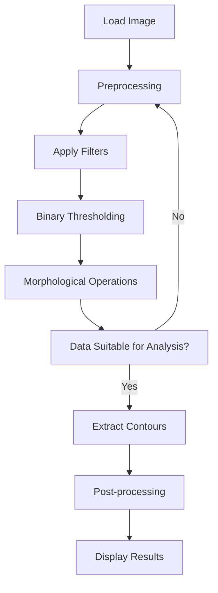

# LAB: "Grayscale Image Segmentation"


**Date: 2023.03.20** 

**StudentID: 21800805** 

**Name: Hwang SeungEun**


## I. Introduction

The goal of this experiment is to classify and count objects in a grayscale image by performing classical image processing techniques.


## II. Procedure

The following steps were taken to achieve the goal:

1. The image was filtered with a Gaussian filter to remove noise. The kernel size used was 21.
2. Thresholding technique was used to obtain a binary image. The threshold type used was binary.
3. Morphological operation of type "open" was applied to the binary image.
4. Contours and hierarchy were obtained using the findContours function.
5. The number of child contours for each contour was determined using the following code:

```c++
for (int i = 0; i < hierarchy.size(); i++) {
    int parent = hierarchy[i][3];
    if (parent >= 0) {c++
        num_child_contours[parent]++;
    }
}
```

6. A loop was used to draw the contours.

7. The best matching shape for each contour was determined using the matchShapes function.

```c++
efor (size_t j = 0; j < ref_indices.size(); j++) {
    double match_value = matchShapes(contours[i], contours[ref_indices[j]], CONTOURS_MATCH_I3, 0);
    match_values[j] = match_value;
    if (match_values[j] < match_values[min_index]) {
        min_index = j;
    }
    shape_idx[i] = min_index;
}
```

8. The area of each contour was calculated using contourArea function.

9. The objects were classified based on their shapes and sizes using the area and shape information.

10. The number of objects in close proximity was determined using the number of child contours.


## III. Flowchart




