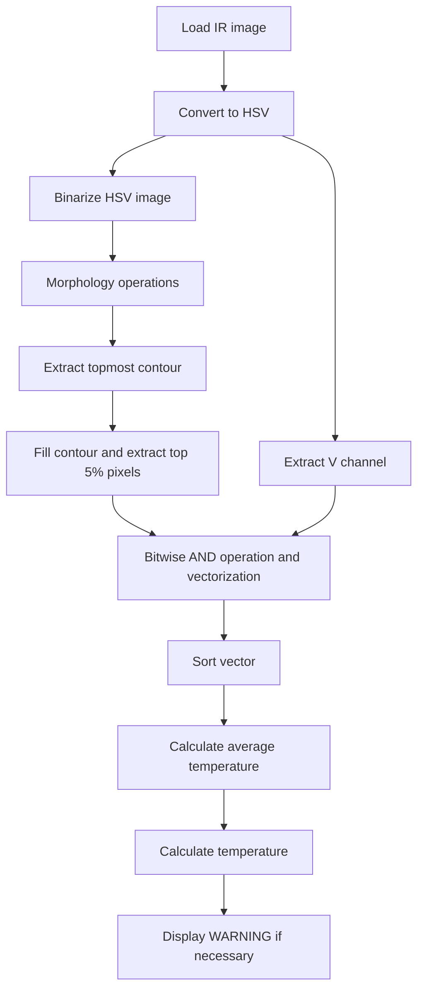

# LAB: Facial Temperature Measurement with IR images

**Date:** 2023.04.01

**Student ID:** 21800805

**Name:** Hwang SeungEun


## I. Introduction

The goal of this project is to create a system that can learn from IR images captured using classical image processing techniques and provide alerts when a fever is detected due to the Wuhan pneumonia.


## II. Procedure

1. Load the IR image
2. Convert the image to HSV color space 
3. Binarize the HSV image using inRange function 
4. Perform morphology operations (dilate) 
5. Extract the topmost contour with area over 6000 
6. Fill the contour on the mask and extract the top 5% of the contour's pixels 
7. Extract the V channel from the HSV image
8. Perform bitwise AND operation between the mask and V channel image
9. Make vector and sort the vector in descending order
10. Calculate the average of the top 5% of the vector values
11. Calculate the temperature using the formula
12. Display a WARNING if temperature




## IV. Experiment

### 1. Loading the IR image

The experiment began with loading the IR image captured for processing. This image would serve as the basis for the following steps in the procedure.


### 2. Converting to HSV color space

The loaded IR image was then converted to the HSV color space to facilitate the extraction of relevant information from the image for further processing.


### 3. Binarizing the HSV image


The HSV image was binarized using the inRange function with V values min = 150 and max = 255. This step was crucial in isolating the areas of interest in the image, as it created a binary representation that would simplify subsequent processing steps.


### 4. Morphology operations

A single dilation operation with a Size(3, 3) structuring element was performed to refine the binarized image. This step helped in smoothing the contours and eliminating noise from the image.


### 5. Extracting topmost contour

One of the challenging aspects of the experiment was extracting the topmost contour with an area greater than 6000. This step required careful consideration and fine-tuning to ensure accurate results.


### 6. Filling the contour and extracting pixels

After obtaining the topmost contour, the area inside the contour was filled in the mask. Then, 5% of the contour's pixels were extracted for further analysis. This step was particularly difficult as it involved accurately selecting only the top 5% of the contour's pixels to calculate the average temperature.


### 7. Extracting the V channel

The V channel was extracted from the image obtained in step 2 to be used for further processing.


### 8. Bitwise AND operation with V channel and vectorization

A bitwise AND operation was performed between the mask created in step 6-a and the V channel image from step 3-b. The result was then vectorized to facilitate sorting and analysis.


### 9. Sorting the vector

The vector was sorted in descending order to identify the top 5% of the values, which would be used to calculate the average temperature.


### 10. Calculating the average temperature

The average of the top 5% of the values obtained in step 9 was calculated. This step proved to be challenging due to the need to accurately extract only the top 5% of the contour's pixels for the calculation.


### 11. Temperature calculation

The temperature was calculated using the formula: temperature = ((average / 255.0) * 15 + 25). This step translated the average value into a temperature value that could be used to determine if a WARNING should be displayed.


### 12. Displaying a WARNING

If the calculated temperature was greater than 37.5 and the maximum temperature was greater than 37, a WARNING was displayed to alert the user.

The experiment followed the outlined procedure, and some of the challenging aspects encountered included extracting the topmost contour in step 5-a and accurately calculating the average temperature using only the top 5% of the contour's pixels in step 10. Despite these challenges, the experiment successfully achieved its objective of measuring facial temperature using IR images.

------


------


## V. Analysis

1. The experiment showed that it is possible to determine the temperature of objects using intensity values in image processing.
2. By utilizing mask operations and ROI, the average temperature of the area of interest was accurately calculated, leading to correct results.
3. Implementing deep learning for object recognition instead of classical image processing might improve the results further.


## VI. Result

1. The key finding of the experiment was the effective use of masks and ROI.
2. When the precise ROI was not applied, the temperature of the last person's neck caused consistent incorrect results.


<iframe width="640" height="560" src="https://www.youtube.com/embed/JTTeE2oyR7A" title="YouTube video player" frameborder="0" allow="accelerometer; autoplay; clipboard-write; encrypted-media; gyroscope; picture-in-picture; web-share" allowfullscreen></iframe>


## VII. Appendix

```c++
#include "myFunc.h"

cv::Mat src,  dst_hsv, dst_thr, dst_morph, dst_ChannelV, mask, mask_V;

cv::VideoCapture cap("IR_DEMO_cut.avi");

int width = cap.get(cv::CAP_PROP_FRAME_WIDTH);
int height = cap.get(cv::CAP_PROP_FRAME_HEIGHT);

cv::VideoWriter out("output.mp4", cv::VideoWriter::fourcc('M', 'J', 'P', 'G'), 30, cv::Size(width, height));

cv::Rect highestBox;

// V 채널만 추출
vector<cv::Mat> hsvChannels;
vector<int> Sort_V, Vec_V;
vector<vector<cv::Point>> contours;

int hmin = 0, hmax = 179, smin = 0, smax = 255, vmin = 150, vmax = 255;

int highestY, highestCont = 0;

int Max_tem = 0;
double temperature, average = 0;
int count005 = 0;

// img는 img 젤 위가 0이기 때문에 시작을 위해서 사진의 높이로 초기화해줌
int upper_box_idx = 0;
int upper_box = height;


void frameRead(void);

void convColor(Mat& _input, Mat& _output, int _color);

void splitCh(Mat& _input, Mat& _output, vector<cv::Mat>& _split);

void Inrange(Mat& _input, Mat& _output);

void Morphology(Mat& _input, Mat& _output);

void Contour(Mat& _input, vector<vector<Point>>& _contour);

void maskChV(vector<vector<Point>>& _contour, Mat& _input, Mat& _output);

void postProcessing(void);

void releaseFile(void);


int main() {

	if (!cap.isOpened())
		return -1;

	while (true) {

		// read frame
		frameRead();

		if (src.empty())
			break;

		//convert color
		convColor(src, dst_hsv, cv::COLOR_BGR2HSV);

		// split chanel
		splitCh(dst_hsv, dst_ChannelV, hsvChannels);

		// threhold
		Inrange(dst_hsv, dst_thr);

		// morphology
		Morphology(dst_thr, dst_morph);

		// contour
		Contour(dst_morph, contours);

		// mask witg v channel
		maskChV(contours, dst_ChannelV, mask_V);

		// post processing
		postProcessing();

		char c = (char)waitKey(1);
		if (c == 27)
			break;

	}

	releaseFile();

	return 0;
}


// =================================================
//						Function
// =================================================
void frameRead(void) {

	// Frame Read
	cap >> src;

}

void convColor(Mat& _input, Mat& _output, int _color) {

	// hsv img
	cv::cvtColor(src, dst_hsv, _color);

}

void splitCh(Mat& _input, Mat& _output, vector<cv::Mat>& _split) {

	// V 채널만 뽑아내기
	cv::split(_input, _split);
	_output = _split[2];

}

void Inrange(Mat& _input, Mat& _output) {

	cv::Scalar rangeMin = cv::Scalar(MIN(hmin, hmax), MIN(smin, smax), MIN(vmin, vmax));
	cv::Scalar rangeMax = cv::Scalar(MAX(hmin, hmax), MAX(smin, smax), MAX(vmin, vmax));

	// 이진화 됨
	cv::inRange(_input, rangeMin, rangeMax, _output);

}

void Morphology(Mat& _input, Mat& _output) {

	cv::dilate(_input, _output, cv::Mat::ones(cv::Size(3, 3), CV_8UC1), cv::Point(-1, -1), 1);
	//printImg("Dilation", dst_morph, width, height);

}


void Contour(Mat& _input, vector<vector<Point>>& _contour){

	// 이거랑 마스크랑 다른점이 뭐임... 
	cv::findContours(_input, _contour, cv::RETR_TREE, cv::CHAIN_APPROX_SIMPLE);

	// 면적이 6000보다 큰 컨투어에 대해 높이가 더 높은 box를 찾기
	highestY = src.rows; // 이미지의 최대 높이로 초기화
	highestCont = _contour.size(); // cntour 개수 최대화

	for (size_t i = 0; i < _contour.size(); i++) {

		int area = cv::contourArea(_contour[i]);
		Rect box = boundingRect(_contour[i]);

		if (area > 6000) {

			if (box.y < highestY) {
				highestY = box.y;
				highestBox = box;
				highestCont = i;
			}
		}
	}
}


void maskChV(vector<vector<Point>>& _contour, Mat& _input, Mat& _output) {

	// mask 생성
	mask = cv::Mat::zeros(src.size(), CV_8UC1);

	//// 마스크 영역에서 픽셀 값 가져오기

	count005 = 0;

	// 컨투어를 기준으로 마스크 적용
	// highestCont(그리려는 컨투어의 인덱스)가 초기값(contours.size() 컨투어 전체 개수)인지 확인 하는 것이 중요하다
	if (highestCont != _contour.size()) {
		cv::drawContours(mask, _contour, static_cast<int>(highestCont), cv::Scalar(255), cv::FILLED);
		// 상위 5% 픽셀 강도의 평균 값 계산
		count005 = round(contourArea(_contour[highestCont]) * 0.05); // 상위 5% 픽셀 개수
	}

	// mask와 v 채널과 and 연산
	bitwise_and(mask, _input, _output);

	printImg("dst_ChannelV", _input, width, height);
	printImg("mask_V", _output, width, height);

}


void postProcessing(void) {

	// 행렬을 백터화
	Vec_V = mask_V.reshape(0, 1);

	cv::sort(Vec_V, Sort_V, cv::SORT_DESCENDING);

	int sum = 0;
	for (int i = 0; i < count005; i++) {
		sum += Sort_V[i];
	}
	if (count005 != 0) {
		average = sum / count005;
	}

	// 25도 I = 0, 40도 I = 255
	// 0 * 15 + 25 = 25
	temperature = ((average / 255.0) * 15 + 25);
	Max_tem = ((Sort_V[0] / 255.0) * 15 + 25);

	cv::String text_MAX = "MAX: ";
	cv::String text_AVG = "AVG: ";

	if (highestCont != contours.size()) {

		if (temperature > 37.5 && Max_tem > 37) {

			rectangle(src, highestBox, Scalar(0, 0, 255), 2, LINE_AA);
			drawContours(src, contours, highestCont, cv::Scalar(255, 255, 255), 2, LINE_8);
			putText(src, text_MAX + to_string(int(Max_tem)) + "   " + text_AVG + to_string(int(temperature)), Point(0, 50), FONT_HERSHEY_SIMPLEX, 1, Scalar(0, 0, 255), 2, LINE_AA);
			putText(src, "WARNING", Point(0, 100), FONT_HERSHEY_SIMPLEX, 2, Scalar(0, 0, 255), 2, LINE_AA);
		}
		else {

			rectangle(src, highestBox, Scalar(0, 255, 0), 2, LINE_AA);
			drawContours(src, contours, highestCont, cv::Scalar(255, 255, 255), 2, LINE_8);
			putText(src, text_MAX + to_string(int(Max_tem)) + "   " + text_AVG + to_string(int(temperature)), Point(0, 50), FONT_HERSHEY_SIMPLEX, 1, Scalar(0, 255, 0), 2, LINE_AA);
		}
	}

	printImg("Output", src, width, height);
	out.write(src);

}

void releaseFile(void) {

	cap.release();
	out.release();

}

```

