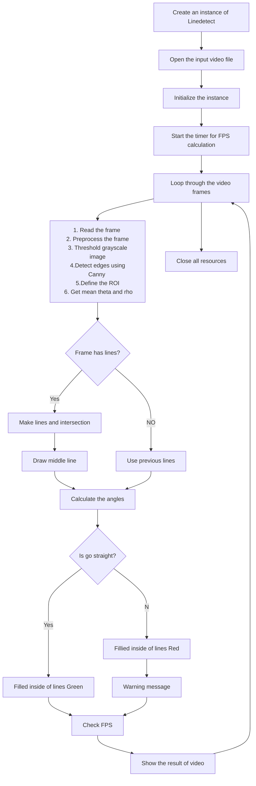

# Lane Departure Warning System for Road Lane Detection

**Date:** 2023.04.30

**Student ID:** 21800805

**Name:** Hwang SeungEun

## I. Introduction

이번 과제에서는 python open cv 를 활용해 lane detection과 차선 방지 오류에 관한 실험을 진행하였다. The goal of this experiment is to help improve road safety and assist drivers in maintaining their position within the lane.

## II. Procedure

1. Create an instance of `Linedetect`
2. Open the input video file
3. Initialize the instance
4. Start the timer for FPS calculation
5. Loop through the video frames:
   - Read the frame
   - Preprocess the frame
     - Gray scale
     - Thresh hold
     - Canny
   - Define the ROI
   - Find and draw lines with `cv2.HoughLines` on the frame
   - Calculate and display the FPS
   - Show the final output frame
   - Write the result to the output file
   - Handle keyboard input for stopping or pausing the video playback
6. Close all resources


##### Explain about class of `Linedetect` 

- `Initialize()`: Set up capture properties, create trackbars and initialize video writer
- `Trackbar()`: Callback function for trackbars
- `Preprocessing()`: Convert the frame to grayscale, apply binary thresholding and perform edge detection using Canny
- `ROI()`: Define the region of interest (ROI) and apply it to the Canny image
- `getLines()`: Find lines in the ROI using HoughLines, classify them as positive or negative slopes, calculate their intersection point, and draw the lines
- `Intersection()`: Calculate the intersection point of two lines
- `drawLines()`: Draw the positive and negative lines, and the midline
- `getBias()`: Calculate the bias between the lines and determine the warning message
- `showVid()`: Display the video frames
- `outResult()`: Write the result to the output file
- `closeAll()`: Close video writer
- `startTime()`: Record the start time for FPS calculation
- `FPS()`: Calculate and display the frames per second (FPS)


## III. Flow Chart



## IV. Experiment

### 1. Create the Instance

class Linedetect를 instance로 선언을 한다. 

```python
class Linedetect:
    ...

def main():
    
	LD = Linedetect()
    ...
```


### 2. Load a Road Video


<center><strong>Figure 1. Source Video</strong></center>

```python
cap = cv.VideoCapture('road_lanechange_student.mp4')
```


### 3. Initialization and Start time

while문이 시작하기 전에 영상의 width와 height를 초기화하고 preprocessing에서 사용할 track bar를 선언한다. 그리고 결과물 출력에 필요한 정보들을 설정한다

```python
class Linedetect:
        def Initialize(self, cap):   
            
        if not cap.isOpened():
            raise FileNotFoundError("Video file is not Found!")        
            
        self.width = int(cap.get(cv.CAP_PROP_FRAME_WIDTH))
        self.height   = int(cap.get(cv.CAP_PROP_FRAME_HEIGHT))

        cv.namedWindow('Track bar', cv.WINDOW_NORMAL)
        cv.createTrackbar('Canny Low', 'Track bar', self.canny_low, 200, self.Trackbar)
        cv.createTrackbar('Canny High', 'Track bar', self.canny_high, 200, self.Trackbar)
        cv.createTrackbar('Hough Threshold', 'Track bar', self.hough_thr, 200, self.Trackbar)
        cv.createTrackbar('Binary Threshold', 'Track bar', self.binary_thr, 200, self.Trackbar)

        self.fourcc = cv.VideoWriter_fourcc(*'XVID')
        self.output_filename = 'output.mp4'
        self.fps = 30
        self.frame_size = (self.width, self.height)
        self.out = cv.VideoWriter(self.output_filename, self.fourcc, self.fps, self.frame_size)

    def Trackbar(self, val):
        return val    
    
        def startTime(self):
        self.start_time = time.time()
        self.prev_time = self.start_time

def main():
	...    
	LD.Initialize(cap)
    
    LD.startTime() 
    ...
```


### 4. Loop through the video frames

#### 4.1 Read the frame and check usable

while문에서 cap의 frame의 유무에 따라 코드 진행을 결정한다.

```python
def main():
    
    # procedure 3
    
    while(cap.isOpened()):
        
        ret, frame = cap.read()
        
        if not ret:
            break
```


#### 4.2 Preprocessing

트렉바를 사용하여 각 파라미터들에 적절한 값을 지정하여 preprocessing을 진행한다. 


<center><strong>Figure 2. Preprocessing with Trackbar</strong></center>

```python
class Linedetect:
    def Preprocessing(self, _frame):
        self.canny_low = cv.getTrackbarPos('Canny Low', 'Track bar')
        self.canny_high = cv.getTrackbarPos('Canny High', 'Track bar')
        self.hough_thr = cv.getTrackbarPos('Hough Threshold', 'Track bar')
        self.binary_thr = cv.getTrackbarPos('Binary Threshold', 'Track bar')

        self.gray = cv.cvtColor(_frame, cv.COLOR_BGR2GRAY)
        _, self.thresh = cv.threshold(self.gray, self.binary_thr, 255, cv.THRESH_BINARY)  
        self.canny = cv.Canny(self.thresh, self.canny_low, self.canny_high)
        
def main():
    
    # procedure 3
    
    while(cap.isOpened()):
        
    # procedure 4.1
    
    LD.Preprocessing(frame)
```


#### 4.3 Reason of Interest (ROI)

최대한 현재 주행 중인 차선만 나올 수 있도록 ROI를 설정한다. 관심영역은 삼각형으로 만들어 진행했다.


<center><strong>Figure 3. Reason of Interest</strong></center>

```python
class Linedetect:
    def ROI(self):
        
        self.mask = np.zeros_like(self.canny)
        # self.roi  = np.array([[(50, self.height - 90),(self.width/2-40, self.height/2+50), 
        #                   (self.width/2+20, self.height/2+50), (self.width-50,self.height - 90)]], dtype=np.int32)
        self.roi  = np.array([[(50, self.height - 90),(self.width/2, self.height/2+60), 
                          (self.width/2, self.height/2+60), (self.width-50,self.height - 90)]], dtype=np.int32)
        cv.fillPoly(self.mask , self.roi, 255)
        self.roi = cv.bitwise_and(self.canny, self.mask)

def main():
    
    # procedure 3
    
    while(cap.isOpened()):
        
    # procedure 4.1
    # procedure 4.2
    
    LD.ROI()
```


#### 4.4 Get line with function HoughLines 

HoughLines 를 활용해서  ROI 영역의 선들을 출력한다.  아래 Figure는 전체적인 선이 잘 나오는지 확인하기 위한 이미지를 출력한 것이다. 

한 frame 안에서 선을 다 출력했으면 기울기가 양수와와 음수 파트를 나누어 각각 저장한 후 각 theta와 rho의 평균값을 구해 저장한다. 이때 현재 프레임에서 추출된 line이 없으면 이전 프레임의 평균값을 사용한다.


<center><strong>Figure 4. Get All lines with HoughLines</strong></center>

구해진 오른쪽 왼쪽 차선의 직선을 활용하여 교점을 구한다. 


#### 4.5 Get mean lines and Intersection


<center><strong>Figure 5. Get Intersection Point</strong></center>

위 Fig 5는 Fig 4 의 직선의 기울기의 평균을 통해 구한 직선과 평균 직선 두개의 교차점을 표시한 것이다. 위 선을 그릴 때 주의할 점은 기울기가 90도가 될 때 기울기가 무한대로 발산하지 않도록 처리해 주는 것이 중요하다. 또한 현재 프레임에서 직선이 검출이 되지 않을시에는 오른쪽차선처럼 노란색, 검출되었을 때는 왼쪽차선과 같이 초록색으로 출력하였다.


#### 4.6 Draw middle line of two lines


<center><strong>Figure 6. Draw the Middle Line</strong></center>

차선을 측정한 두 직선의 각도를 측정해 중간으로 오도록 설정을 한다. 중간선도 마찬가지로 기울기가 발산하지 않도록 처리를 한다.


#### 4.7 Change lane


<center><strong>Figure 7. Going Straight</strong></center>


<center><strong>Figure 8. Lane Change to Right</strong></center>


<center><strong>Figure 8. Lane Change to Left</strong></center>

직진을 할 때는 procedure 4.6에 직선 내부의 도로색이 초록색으로 채워진다. 하지만 차선 변경을 진행할 때는 도로와 직선의 색을 붉은색으로 칠했다. 차선 변경은 middle line 기준으로 양쪽 직선의 각을 측정한다. 두 각의 차이가 커질 때 차선 변경으로 감지한다. 


#### 4.8 Put Warning Message


<center><strong>Figure 9. Warning Message</strong></center>

```python
class Linedetect:    
    def getLines(self, _frame):
        self.lines = cv.HoughLines(self.roi, self.hough_rho, self.hough_theta, self.hough_thr)
        
        # 넘파이는 height 다음 width  입니다!!!
        self.line_img = np.zeros((self.height, self.width, 3), dtype=np.uint8)
        self.lines_pos = []
        self.lines_neg = []
        if self.lines is not None and len(self.lines) > 0:
            for i in range(len(self.lines)):
                for rho, theta in self.lines[i]:

                    self.slope = np.tan(theta)
                    if(self.slope > 0): 
                        self.lines_pos.append((rho, theta))
                    else:
                        self.lines_neg.append((rho, theta))
                    
            if len(self.lines_pos) > 0:
                self.avg_rho_pos, self.avg_theta_pos = np.mean(self.lines_pos, axis = 0)
                self.prev_line_pos = (self.avg_rho_pos, self.avg_theta_pos)
                self.color_pos = color_g

            elif self.prev_line_pos is not None:
                self.avg_rho_pos, self.avg_theta_pos = self.prev_line_pos
                self.color_pos = color_y
            
            if len(self.lines_neg) > 0:
                self.avg_rho_neg, self.avg_theta_neg = np.mean(self.lines_neg, axis = 0)
                self.prev_line_neg = (self.avg_rho_neg, self.avg_theta_neg)
                self.color_neg = color_g

            elif self.prev_line_neg is not None:
                self.avg_rho_neg, self.avg_theta_neg = self.prev_line_neg
                self.color_neg = color_y

        self.intersection = self.Intersection(self.prev_line_pos, self.prev_line_neg)
        self.line_point_pos, self.line_point_neg, self.line_point_cen = self.drawLines(self.prev_line_pos, self.prev_line_neg)

        if self.intersection is not None:

            cv.circle(self.line_img, self.intersection, 3, self.mask_road, 4)
            cv.line(self.line_img, self.intersection, self.line_point_pos, self.color_pos, 5)
            cv.line(self.line_img, self.intersection, self.line_point_neg, self.color_neg, 5)
            cv.line(self.line_img, self.intersection, self.line_point_cen, color_w, 2)

            mask = np.zeros_like(_frame)
            pts = np.array([self.intersection, self.line_point_pos, self.line_point_neg], dtype=np.int32)
            cv.fillConvexPoly(mask, pts, self.mask_road)

            self.result = cv.addWeighted(_frame, 0.7, mask, 0.4, 0)
            self.result = cv.addWeighted(self.result, 1, self.line_img, 1, 0)
                        
            # 차선 이동 여부 출력
            cv.putText(self.result, self.line_dir, (int(self.width/5), int(self.height/2)), cv.FONT_HERSHEY_SIMPLEX, 3, (255, 0, 255), 5)
            diff_deg = f"Angle Diffrent: {(self.diff_deg):.2f}"
            cv.putText(self.result, diff_deg, (10, 60), cv.FONT_HERSHEY_SIMPLEX, 1, (0, 255, 0), 2)

    def Intersection(self, line_pos, line_neg):

        rho1, theta1 = line_pos
        rho2, theta2 = line_neg

        A = np.array([
            [np.cos(theta1), np.sin(theta1)],
            [np.cos(theta2), np.sin(theta2)]
        ])
        b = np.array([[rho1], [rho2]])
        x0, y0 = np.linalg.solve(A, b)
        x0, y0 = int(np.round(x0)), int(np.round(y0))
    
        return [x0, y0]    
       
    def drawLines(self, line_pos, line_neg):
        extended_y = self.height + 100

        rho1, theta1 = line_pos
        m1 = -np.cos(theta1) / np.sin(theta1)
        b1 = rho1 / np.sin(theta1)

        if not np.isinf(m1) and not np.isnan(m1):
            x1 = int((extended_y - b1) / m1)
            y1 = extended_y
            self.prev_x1 = x1
            self.prev_y1 = y1
        else:
            x1 = self.prev_x1
            y1 = self.prev_y1
        
        self.slope_pos = m1

        rho2, theta2 = line_neg
        m2 = -np.cos(theta2) / np.sin(theta2)
        b2 = rho2 / np.sin(theta2)

        if not np.isinf(m2) and not np.isnan(m2):
            x2 = int((extended_y - b2) / m2)
            y2 = extended_y
            self.prev_x2 = x2
            self.prev_y2 = y2
        else:
            x2 = self.prev_x2 
            y2 = self.prev_y2
        
        self.slope_neg = m2

        xm, ym = self.getBias(x1, x2, extended_y)

        return (x1, y1), (x2, y2), (xm, ym)

    def getBias(self, x1, x2, extended_y):
        
        x0, y0 = self.intersection
        xm = int((x1+ x2) / 2)
        ym = extended_y

        if x0 != xm:
            self.slope_mid = -(y0 - ym) /(x0 - xm)
            self.prev_slope_mid = self.slope_mid
        else:
            self.slope_mid = self.prev_slope_mid

        self.theta_mid      = np.degrees(np.arctan(self.slope_mid))

        if(self.theta_mid < 0):
            self.theta_mid = -self.theta_mid
        elif(self.theta_mid > 0):
            self.theta_mid = 180 - self.theta_mid
        
        self.diff_deg_pos = -np.degrees(np.arctan(self.slope_pos)) + 90 - self.theta_mid
        self.diff_deg_neg = self.theta_mid - np.degrees(np.arctan(self.slope_neg))

        self.diff_deg = self.diff_deg_pos - self.diff_deg_neg

        # print('diff_deg: ' + str(self.diff_deg))

        if self.diff_deg > 75 :
            self.line_dir = 'WARNING!! Go Left'
            self.mask_road = color_r
            self.color_pos = color_r
            self.color_neg = color_r 

        elif self.diff_deg < - 75:
            self.line_dir = 'WARNING!! Go Right'
            self.mask_road = color_r
            self.color_pos = color_r
            self.color_neg = color_r

        else:
            self.line_dir = ''
            if len(self.lines_pos) > 0:
                self.color_pos = color_g

            elif self.prev_line_pos is not None:
                self.color_pos = color_y
            
            if len(self.lines_neg) > 0:
                self.color_neg = color_g

            elif self.prev_line_neg is not None:
                self.color_neg = color_y

            self.mask_road = color_g

        return (xm, ym)

def main():
    
    
    while(cap.isOpened()):
        
    # procedure 4.1
    # procedure 4.2
    # procedure 4.2

        LD.getLines(frame)

        LD.FPS()

        LD.showVid("final", LD.result)

        LD.outResult()

        k = cv.waitKey(1) & 0xFF
        if k == ord('q')   :   break
        elif k == ord('s') :   cv.waitKey()

    LD.closeAll()
```


## Conclusion


본 조사에서는 도로 차선을 정확하게 감지하고 의도하지 않은 차선 이탈 시 운전자에게 신속하게 알리기 위해 첨단 차선 이탈 경고 시스템을 세심하게 설계 및 구현했습니다. 제안하는 시스템은 정교한 이미지 처리 작업을 위한 OpenCV, 정확한 라인 감지를 위한 HoughLines 알고리즘, 필수적인 수학 연산을 수행하기 위한 NumPy의 통합을 기반으로 구축되었습니다.


이 연구에서 직면한 주목할만한 도전은 허프 좌표계와 데카르트 좌표계 사이의 각도를 변환하는 복잡한 과정이었습니다. 이 작업에는 원하는 수준의 정확도를 달성하기 위해 상당한 양의 실험과 반복적인 개선이 필요했습니다. 정상적인 경로 변경의 성공적인 계산은 이 두 좌표계의 통합에 달려 있습니다.


결과는 계산된 프레임 속도로 실시간으로 렌더링되므로 도로에서 차량 안전을 개선하기 위한 효율적이고 신뢰할 수 있는 솔루션을 보장합니다.

