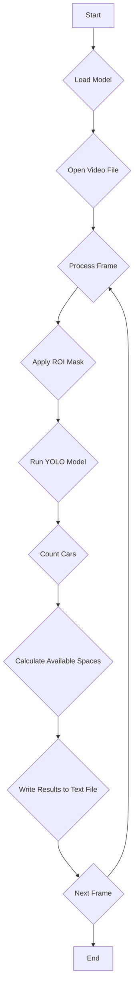

# LAB4: Parking management using deep learning

**Date:** 2023.05.26

**Student ID:** 21800805

**Name:**  Seung-Eun Hwang

**[demo video](https://youtu.be/vEExP6lvqUQ)**

## I. Introduction

The goal of this project was to create a program that identifies available parking spaces in a given video feed using a deep learning model. This real-world application has significant potential for improving efficiency in parking management systems and enhancing user experience in finding parking spaces.


## II.Algorithm

The deep learning algorithm used for this project is YOLO v8 (You Only Look Once). YOLOv8 is a popular algorithm for object detection because it's efficient and capable of detecting objects in real-time. This is particularly suitable for our project where real-time processing of video frames is required to identify available parking spaces.


## III. Procedure

1. Load the deep learning model (in this case, YOLO v8).
2. Open the video file for processing.
3. Process each frame of the video:
   - Apply a region of interest mask.
   - Run the YOLO model on the masked frame.
   - Count the number of detected cars.
   - Subtract the number of cars from the total number of parking spaces to get the number of available spaces.
4. Write the results for each frame (number of cars and available parking spaces) to a text file.
5. Repeat the process for each frame in the video.


## IV. Flow Chart



## V. Experiment

### Process

#### Pre-processing

The preprocessing stage involves applying a region of interest (ROI) mask to each frame. This is done to focus the model's attention on the area where parking spaces are located and reduce unnecessary computations elsewhere.

```python
mask = np.zeros_like(frame)
cv2.fillPoly(mask, np.array([roi_region], dtype=np.int32), (255, 255, 255))
mask_frame = cv2.bitwise_and(frame, mask)
```


#### Filtering

The filtering stage involves discarding detections that are too small to be a car. This is done by comparing the area of the bounding box of each detection to a predefined threshold.

```python
size = s[2] * s[3]
if size_cut < size:
    cv2.rectangle(frame, r[:2], r[2:], (51, 153, 255), 2)
    num_car += 1
```


more over yolo model detect car, bus and truck.  하지만 주어진 영상에서는 car만 있고 truck과 버스는 존재하지 않는다. 불확실한 객체라 다른 자동차의 종류로 인식된 것이다. 그래서 세개를 모두 하나의 결과가 나올 수 있게 다음과 같이 if 문을 작성했다

```python
if (cls == 2 or cls == 6 or cls == 7):
```


그리고 객체가 겹치는 것을 방지하기 위해 인식된 객체의 x좌표 중점을 구하고, 한 프레임 안에서 측정한 다른 bounding box 의 위치와의 pixel거리를 비교한다. box_dist_thr 의 값보다 작다면 같은 객체로 판단하여 중복하여 자동차를 count하는 것을 방지한다.

```python
if any([abs(x_cen - prevcenX) < box_dist_thr for prevcenX in x_centers]):  
   continue
```


frame별로 주차된 차량의 수를 txt파일로 저장을 하였고 주어진 답지와 비교를했을 때 총 1500 frame에서 accuracy: 81.29% 를 보인다


## VI. Result and Discussion

### 1. Final Result

<iframe width="640" height="560" src="https://www.youtube.com/embed/vEExP6lvqUQ" title="YouTube video player" frameborder="0" allow="accelerometer; autoplay; clipboard-write; encrypted-media; gyroscope; picture-in-picture; web-share" allowfullscreen></iframe>

### 2. Discussion

The effectiveness of this model in identifying available parking spaces can be seen from the quantitative result of the processing speed. An average processing speed of 30~ 40 frames per second (FPS) was achieved during the simulation, which signifies a fast and efficient performance. This high processing speed is crucial in real-time applications such as this one, where timely information about available parking spaces can greatly improve user experience.


## VII. Conclusion

In conclusion, this experiment demonstrated the application of a deep learning model (YOLO) in identifying available parking spaces from a video feed. The high processing speed achieved during the simulation shows that such a system could be implemented in real-time applications, thereby providing practical benefits for parking management systems. Future work could involve refining the model for higher accuracy and testing it in different scenarios to ensure robust performance.