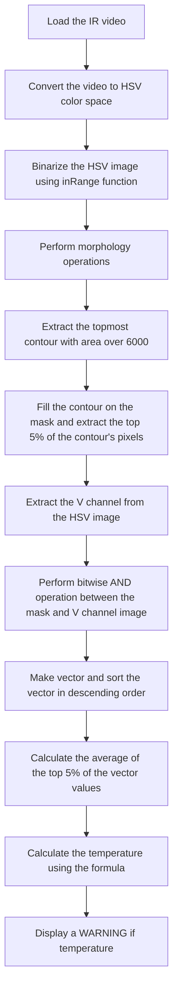

# LAB: Facial Temperature Measurement with IR images

**Date: 2023-04-10**
**Student ID: 21800805**
**Name: Hwang SeungEun**


## I. Introduction

The goal of this project is to create a system that can learn from IR images captured using classical image processing techniques and provide alerts when a fever is detected due to the Wuhan pneumonia.


## II. Procedure

1. Load the IR image
2. Convert the image to HSV color space 
3. Binarize the HSV image using inRange function 
4. Perform morphology operations (dilate) 
5. Extract the topmost contour with area over 6000 
6. Fill the contour on the mask and extract the top 5% of the contour's pixels 
7. Extract the V channel from the HSV image
8. Perform bitwise AND operation between the mask and V channel image
9. Make vector and sort the vector in descending order
10. Calculate the average of the top 5% of the vector values
11. Calculate the temperature using the formula
12. Display a WARNING if temperature




## IV. Experiment

### 1. Load the IR video

The IR video was loaded in advance to facilitate the image processing steps.

### 2. Convert HSV color space

The video was converted to HSV color space for the following reasons:

- Intensity values in RGB are inaccurate
- To identify a relatively high-temperature region using the intensity value of the V channel


### 3. Binarize the HSV video using inRange function


The HSV video was binarized using the inRange function. By outputting the histogram of the V channel in HSV, it is determined where the threshold should be appropriately set. The min value of V is set using the trackbar. Among them, the V min value that does not cut off the face area is 150.


### 4. Perform morphology operations (dilate)

Morphology is used to increase or decrease a region in a binarized image. I used dilate once to amplify the white area to remove the empty areas in the image.


### 5. Extract the topmost contour

In order to find only a large area such as a face, a conditional statement was specified so that only a certain size or more can be output. Experimentally, I found that 6000 was adequate. In addition, in order to extract only the area of the face, the idx of the area with the highest y coordinate among the contours over 6000 (the contour is the highest) was saved and only that part was output.

### 6. Fill the contour on the mask and extract the top 5% of the contour's pixels

If only the face contour is specified, 5% of the pixels in the face area are output and stored. This number will be used later in the V-channel of the face area.


### 7. Extract the V channel from the HSV video

The V channel was extracted from the HSV video to be used in later steps.


### 8. Perform bitwise AND operation between the mask and V channel video

In the V channel with only the face area, the pixel values are sorted in ascending order, and the 5% value obtained earlier is used to calculate the average of the top 5% of the V channel.


### 9. Calculate the temperature using the formula

Linearization is performed by putting the temperature into a linear function using the calculated intensity value of the top 5%. The formula used is: temperature = ((average / 255.0) * 15 + 25).

### 10. Display a WARNING if the temperature

If the calculated temperature was greater than 37.5 and the maximum temperature was greater than 37, a WARNING was displayed to alert the user.

The experiment followed the outlined procedure, and some of the challenging aspects encountered included extracting the topmost contour in step 5-a and accurately calculating the average temperature using only the top 5% of the contour's pixels in step 10. Despite these challenges, the experiment successfully achieved its objective of measuring facial temperature using IR images.


## V. Analysis

1. The experiment showed that it is possible to determine the temperature of objects using intensity values in image processing.
2. By utilizing mask operations and ROI, the average temperature of the area of interest was accurately calculated, leading to correct results.
3. Implementing deep learning for object recognition instead of classical image processing might improve the results further.


## VI. Result

1. The key finding of the experiment was the effective use of masks and ROI.
2. When the precise ROI was not applied, the temperature of the last person's neck caused consistent incorrect results.


<iframe width="640" height="560" src="https://www.youtube.com/embed/JTTeE2oyR7A" title="YouTube video player" frameborder="0" allow="accelerometer; autoplay; clipboard-write; encrypted-media; gyroscope; picture-in-picture; web-share" allowfullscreen></iframe>


## VII. Appendix

```c++
#include "myFunc.h"

cv::Mat src,  dst_hsv, dst_thr, dst_morph, dst_ChannelV, mask, mask_V;

cv::VideoCapture cap("IR_DEMO_cut.avi");

int width = cap.get(cv::CAP_PROP_FRAME_WIDTH);
int height = cap.get(cv::CAP_PROP_FRAME_HEIGHT);

cv::VideoWriter out("output.mp4", cv::VideoWriter::fourcc('M', 'J', 'P', 'G'), 30, cv::Size(width, height));

cv::Rect highestBox;

// V 채널만 추출
vector<cv::Mat> hsvChannels;
vector<int> Sort_V, Vec_V;
vector<vector<cv::Point>> contours;

int hmin = 0, hmax = 179, smin = 0, smax = 255, vmin = 150, vmax = 255;

int highestY, highestCont = 0;

int Max_tem = 0;
double temperature, average = 0;
int count005 = 0;

// img는 img 젤 위가 0이기 때문에 시작을 위해서 사진의 높이로 초기화해줌
int upper_box_idx = 0;
int upper_box = height;


void frameRead(void);

void convColor(Mat& _input, Mat& _output, int _color);

void splitCh(Mat& _input, Mat& _output, vector<cv::Mat>& _split);

void Inrange(Mat& _input, Mat& _output);

void Morphology(Mat& _input, Mat& _output);

void Contour(Mat& _input, vector<vector<Point>>& _contour);

void maskChV(vector<vector<Point>>& _contour, Mat& _input, Mat& _output);

void postProcessing(void);

void releaseFile(void);


int main() {

	if (!cap.isOpened())
		return -1;

	while (true) {

		// read frame
		frameRead();

		if (src.empty())
			break;

		//convert color
		convColor(src, dst_hsv, cv::COLOR_BGR2HSV);

		// split chanel
		splitCh(dst_hsv, dst_ChannelV, hsvChannels);

		// threhold
		Inrange(dst_hsv, dst_thr);

		// morphology
		Morphology(dst_thr, dst_morph);

		// contour
		Contour(dst_morph, contours);

		// mask witg v channel
		maskChV(contours, dst_ChannelV, mask_V);

		// post processing
		postProcessing();

		char c = (char)waitKey(1);
		if (c == 27)
			break;

	}

	releaseFile();

	return 0;
}


// =================================================
//						Function
// =================================================
void frameRead(void) {

	// Frame Read
	cap >> src;

}

void convColor(Mat& _input, Mat& _output, int _color) {

	// hsv img
	cv::cvtColor(src, dst_hsv, _color);

}

void splitCh(Mat& _input, Mat& _output, vector<cv::Mat>& _split) {

	// V 채널만 뽑아내기
	cv::split(_input, _split);
	_output = _split[2];

}

void Inrange(Mat& _input, Mat& _output) {

	cv::Scalar rangeMin = cv::Scalar(MIN(hmin, hmax), MIN(smin, smax), MIN(vmin, vmax));
	cv::Scalar rangeMax = cv::Scalar(MAX(hmin, hmax), MAX(smin, smax), MAX(vmin, vmax));

	// 이진화 됨
	cv::inRange(_input, rangeMin, rangeMax, _output);

}

void Morphology(Mat& _input, Mat& _output) {

	cv::dilate(_input, _output, cv::Mat::ones(cv::Size(3, 3), CV_8UC1), cv::Point(-1, -1), 1);
	//printImg("Dilation", dst_morph, width, height);

}


void Contour(Mat& _input, vector<vector<Point>>& _contour){

	// 이거랑 마스크랑 다른점이 뭐임... 
	cv::findContours(_input, _contour, cv::RETR_TREE, cv::CHAIN_APPROX_SIMPLE);

	// 면적이 6000보다 큰 컨투어에 대해 높이가 더 높은 box를 찾기
	highestY = src.rows; // 이미지의 최대 높이로 초기화
	highestCont = _contour.size(); // cntour 개수 최대화

	for (size_t i = 0; i < _contour.size(); i++) {

		int area = cv::contourArea(_contour[i]);
		Rect box = boundingRect(_contour[i]);

		if (area > 6000) {

			if (box.y < highestY) {
				highestY = box.y;
				highestBox = box;
				highestCont = i;
			}
		}
	}
}


void maskChV(vector<vector<Point>>& _contour, Mat& _input, Mat& _output) {

	// mask 생성
	mask = cv::Mat::zeros(src.size(), CV_8UC1);

	//// 마스크 영역에서 픽셀 값 가져오기

	count005 = 0;

	// 컨투어를 기준으로 마스크 적용
	// highestCont(그리려는 컨투어의 인덱스)가 초기값(contours.size() 컨투어 전체 개수)인지 확인 하는 것이 중요하다
	if (highestCont != _contour.size()) {
		cv::drawContours(mask, _contour, static_cast<int>(highestCont), cv::Scalar(255), cv::FILLED);
		// 상위 5% 픽셀 강도의 평균 값 계산
		count005 = round(contourArea(_contour[highestCont]) * 0.05); // 상위 5% 픽셀 개수
	}

	// mask와 v 채널과 and 연산
	bitwise_and(mask, _input, _output);

	printImg("dst_ChannelV", _input, width, height);
	printImg("mask_V", _output, width, height);

}


void postProcessing(void) {

	// 행렬을 백터화
	Vec_V = mask_V.reshape(0, 1);

	cv::sort(Vec_V, Sort_V, cv::SORT_DESCENDING);

	int sum = 0;
	for (int i = 0; i < count005; i++) {
		sum += Sort_V[i];
	}
	if (count005 != 0) {
		average = sum / count005;
	}

	// 25도 I = 0, 40도 I = 255
	// 0 * 15 + 25 = 25
	temperature = ((average / 255.0) * 15 + 25);
	Max_tem = ((Sort_V[0] / 255.0) * 15 + 25);

	cv::String text_MAX = "MAX: ";
	cv::String text_AVG = "AVG: ";

	if (highestCont != contours.size()) {

		if (temperature > 37.5 && Max_tem > 37) {

			rectangle(src, highestBox, Scalar(0, 0, 255), 2, LINE_AA);
			drawContours(src, contours, highestCont, cv::Scalar(255, 255, 255), 2, LINE_8);
			putText(src, text_MAX + to_string(int(Max_tem)) + "   " + text_AVG + to_string(int(temperature)), Point(0, 50), FONT_HERSHEY_SIMPLEX, 1, Scalar(0, 0, 255), 2, LINE_AA);
			putText(src, "WARNING", Point(0, 100), FONT_HERSHEY_SIMPLEX, 2, Scalar(0, 0, 255), 2, LINE_AA);
		}
		else {

			rectangle(src, highestBox, Scalar(0, 255, 0), 2, LINE_AA);
			drawContours(src, contours, highestCont, cv::Scalar(255, 255, 255), 2, LINE_8);
			putText(src, text_MAX + to_string(int(Max_tem)) + "   " + text_AVG + to_string(int(temperature)), Point(0, 50), FONT_HERSHEY_SIMPLEX, 1, Scalar(0, 255, 0), 2, LINE_AA);
		}
	}

	printImg("Output", src, width, height);
	out.write(src);

}

void releaseFile(void) {

	cap.release();
	out.release();

}

```

